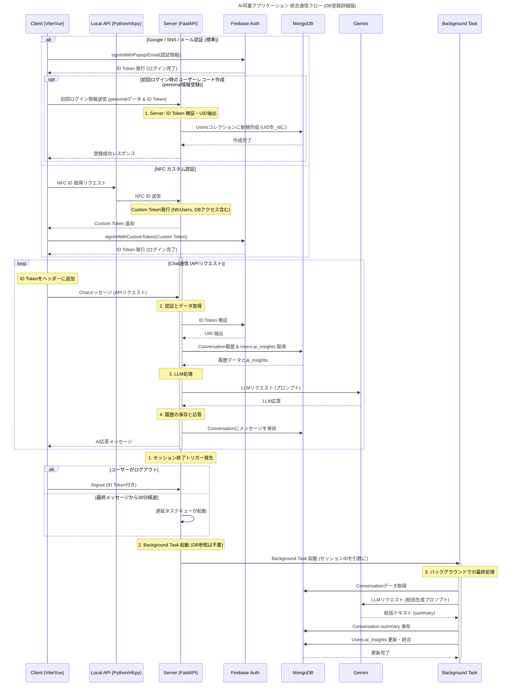
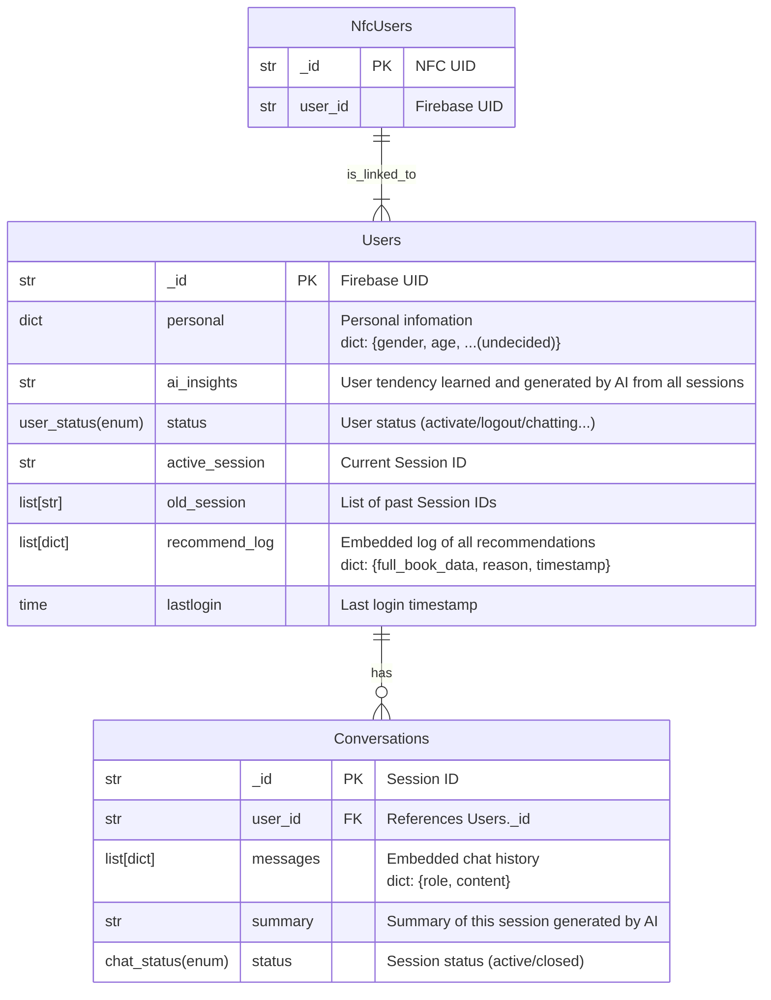

# LiVraria バックエンド技術仕様書

> [!IMPORTANT]
> このドキュメントはAIによって生成されています。
> そのため、誤字脱字や不正確な情報が含まれている可能性があります。

## 1. はじめに

本技術仕様書は、AI司書アプリケーション「LiVraria」のバックエンド開発を担当するエンジニアを対象とする。LiVrariaプロジェクトの目標は、AIとの自然な対話を通じて、利用者一人ひとりに最適な書籍を提案し、書籍や図書館への関心を深めてもらうことにある。この中核的なコンセプトを実現するため、堅牢かつ柔軟なバックエンドシステムの構築が不可欠である。

本仕様書では、システムの根幹をなす主要な技術要素、すなわち認証、データベース設計、API連携、そしてユーザー体験を向上させるための非同期処理について、その設計思想と具体的な実装方針を詳細に解説する。各セクションを通じて、LiVrariaがどのようにして応答性と拡張性を両立させるのかを明らかにする。

## 2. システムアーキテクチャ概要

LiVrariaのシステムは、フロントエンド、バックエンド、データベース、そして複数の外部サービスが密に連携することで機能する。このアーキテクチャは、ユーザーからのリクエストに対する迅速な応答（体感速度）を最優先しつつ、将来的な機能拡張にも耐えうるスケーラビリティを確保するよう設計されている。フロントエンドがユーザーとの対話を受け持ち、バックエンドがビジネスロジックと外部サービス連携のすべてを担う。

主要コンポーネントと役割

コンポーネント	主要技術/サービス	役割
フロントエンド	Vue 3 (Vite)	ユーザーインターフェースの描画、ユーザー入力の受付、バックエンドAPIとの通信
バックエンド	Python (FastAPI)	APIエンドポイントの提供、ビジネスロジックの実行、LLMおよび外部APIとの連携
データベース	MongoDB	ユーザー情報、会話履歴、書籍データなどの永続化
認証	Firebase Authentication	ユーザー認証（標準/カスタム）とセッショントークンの管理
AIモデル	Gemini / Ollama	自然言語対話の生成、会話の要約、ユーザー傾向の分析（環境変数で切り替え可能）
ハードウェア	Raspberry Pi	クライアント端末（書見台型デバイス）の実行環境、NFCリーダーなどの物理デバイス制御
外部API	CiNii、Calil API、Rakuten Books API	書籍情報の検索

通信フロー



システム全体の通信フローは、物理デバイス固有の通信とクラウドベースの通信という二つの経路に戦略的に分離されている。初期認証におけるNFC IDの読み取りなど、ハードウェアに密接に関連する通信は、Raspberry Pi上のローカルAPIによって処理される。その後、ユーザーが認証されると、チャット対話やデータ参照といった後続のすべての通信は、スケーラブルなクラウドバックエンドへの標準的なHTTPSリクエストに切り替わる。このデュアルパスアーキテクチャにより、物理デバイスとの連携という特異な要件を満たしつつ、システムの主要機能におけるパフォーマンスと拡張性を担保する。

この堅牢なアーキテクチャは、物理デバイス（NFC）とウェブ標準を組み合わせた本システム特有の複雑な認証フローを支える基盤となる。次のセクションでは、その認証メカニズムについて詳述する。

## 3. 認証フロー

本システムは、書見台型デバイスに設置されたNFCリーダーによる物理認証と、一般的なウェブアプリケーションで用いられる標準認証（Google, SNS, メール）の両方に対応する必要がある。この二つの異なる認証方式をシームレスに統合するため、FirebaseのCustom Token認証を戦略的に採用した。これにより、バックエンドサーバーがNFC認証の成功を保証し、Firebaseが一元的にセッションを管理する、安全かつ柔軟な認証フローが実現される。

認証プロセスでは、役割の異なる2種類のトークンが重要な役割を担う。

トークン種別	発行元	主な役割	有効期間と用途
Custom Token	FastAPIバックエンド (Firebase Admin SDK)	NFC認証成功を証明する署名付きチケット。Firebaseに提示するために一度だけ使用される。	短時間で失効。クライアントがFirebaseに signInWithCustomToken をリクエストする際に使用。
ID Token (JWT)	Firebase Authentication	Firebaseによって認証されたユーザーのセッション証明書。バックエンドAPIへのリクエスト時に本人証明としてヘッダーに添付される。	一定時間有効。クライアントからの全てのAPIリクエストで必須。

### 3.1. NFCカスタム認証フロー

ユーザーがNFCカードをリーダーにかざしてからログインが完了するまでのプロセスは、以下のステップで実行される。

1. NFC IDの取得要求: Client (Vue) は、Raspberry Pi上で動作するLocal API (Flask/pyscard) に対し、HTTP経由でNFC読み取り開始をリクエストする（`POST /start-nfc`）。
2. NFC IDのポーリング: Client は定期的に`GET /check-nfc`エンドポイントをポーリングし、NFC IDの読み取り状態を確認する。
3. Custom Tokenの発行要求: NFC IDが取得できたら、ClientはそのIDをペイロードに含め、メインのServer (FastAPI) 上のエンドポイント（`/nfc/auth`）にHTTPリクエストとして送信する。
4. Custom Tokenの発行と返却: Serverは受信したNFC IDをNfcUsersコレクションで検証し、正当性が確認できればFirebase Admin SDKを用いてCustom Tokenを発行し、Clientに返却する。
5. FirebaseでのサインインとID Token取得: Clientは受け取ったCustom Tokenを使い、Firebase AuthのsignInWithCustomTokenを呼び出す。Firebaseは認証を完了し、Clientにセッション証明書であるID Tokenを発行する。これによりAPIアクセスが可能になる。

### 3.2. 標準認証フロー

Googleアカウント、各種SNS、またはメールアドレスとパスワードを用いた標準的な認証フローは、Firebaseが提供する標準メソッド（例: signInWithPopup, signInWithEmailAndPassword）を利用してクライアント側で完結する。認証が成功すると、Firebaseから直接ID Tokenが発行される。

初回ログイン時には、クライアントは取得したID Tokenをバックエンドサーバーに送信する。サーバーはID Tokenを検証してユーザーのUIDを抽出し、そのUIDを主キー（_id）としてMongoDBのUsersコレクションに新しいユーザーレコードを作成する。

これら二つの認証方式によって確立されたセッションは、以降のすべてのAPIリクエストで利用される。このセッション情報（UID）を基に、データベースからユーザー固有のデータを読み書きし、パーソナライズされた対話体験を提供する。次のセクションでは、そのデータを格納するデータベースの設計について詳述する。

## 4. データベース設計 (MongoDB)

本システムのデータベース設計は、NoSQLデータベースであるMongoDBの特性を最大限に活かすことを基本方針とする。具体的には、会話のメッセージ履歴のように関連性が強く、同時に読み込まれることが多いデータは**埋め込み（Embedding）形式で単一ドキュメント内に格納し、データの一貫性と読み込み性能を向上させる。一方で、ユーザーと会話セッションのように独立したライフサイクルを持つエンティティ間は参照（Referencing）**で関連付け、データの正規化と柔軟性を担保する。

### 4.1. Users コレクション

ユーザーに関するマスターデータを管理する、システムの中核となるコレクションである。

* _id: Firebase Authenticationが発行するUIDと同一の値。コレクションの主キー。
* personal: ユーザーの性別や年齢といった属性情報を格納するオブジェクト。
* ai_insights: 最重要フィールド。これはユーザーの傾向を統合したサマリーであり、LLMへのコンテキストとしてプロンプトに挿入されることで、対話の一貫性とパーソナライゼーションを担保する役割を担う。
* recommend_log: これまでにAIが推薦した書籍の履歴を格納する、埋め込みドキュメントのリスト。

### 4.2. NfcUsers コレクション

このコレクションは、NFCカードの物理的なIDと、システムのユーザーID（Firebase UID）を紐付けるという単一の目的のために存在する。NFC認証時に、カードIDからユーザー情報を高速に検索する役割を担う。

* _id: NFCカードのUID。コレクションの主キー。
* user_id: 関連するUsersコレクションの_idを参照する外部キー。

### 4.3. Conversations コレクション

個々のチャットセッションにおける、ユーザーとAIの発言履歴をすべて記録するためのコレクションである。

* _id: セッションごとに一意に発行されるセッションID。コレクションの主キー。
* user_id: この会話を行ったユーザーのID（Users._idへの参照）。
* messages: {role: 'user' | 'model', content: '...'} という形式のオブジェクトを格納するリスト。チャットの全履歴がここに時系列で埋め込まれる。
* summary: 非同期処理で生成されるフィールド。セッションが終了した際に、AIがこの会話全体の要約を生成し、ここに格納する。このデータは、後にUsers.ai_insightsを更新するための材料となる。

### 4.4. ~~Books コレクション~~ 廃止

~~国立国会図書館サーチAPIなど、外部サービスから取得した書籍のメタデータを格納するコレクションである。重複を避けるため、ISBNやNCID（全国書誌番号）を主キー（_id）として管理する。~~
小規模開発かつ、キャッシュの探索や、内容更新などに追いつけないと考えたため、Booksは廃止
代わりに、Recommend_logに推薦した本の情報を埋め込んでおく。

* _id: ISBNまたはNCID。主キー。
* title: 書籍名。
* author: 著者名。
* publisher: 出版社。
* pub_date: 出版日。




erDiagramで示される通り、Usersは複数のConversationsを持ち、NfcUsersはUsersに紐づく関係性である。

これらのデータ構造は、ユーザーとのリアルタイムな対話と、バックグラウンドでのAI学習プロセスを両立させるAPIの設計に直結する。次のセクションでは、これらのデータを活用するAPIの仕様とLLM連携の仕組みについて解説する。

## 5. API仕様とLLM連携

本システムのAPI設計における最優先事項は、ユーザーの体感応答速度である。AIとの対話において遅延は体験の質を著しく損なうため、アーキテクチャレベルで処理を分離する戦略を採用した。具体的には、ユーザーとの対話に直接関わる処理は同期的に実行して即時応答を返し、時間のかかる会話の要約やユーザー傾向の分析といった処理は、応答後に非同期のバックグラウンドタスクとして実行する。この同期・非同期分離アーキテクチャは、セッション中の会話履歴を単一ドキュメントに埋め込む（Conversations.messages）MongoDBの設計と密接に連携している。これにより、同期処理では高速な読み書きを実現し、非同期処理ではセッションデータを効率的に一括取得することが可能となる。

### 5.1. 同期処理: チャットAPI

ユーザーからのチャットメッセージを受け取り、AIからの応答を返すメインのエンドポイント（`POST /sessions/{session_id}/messages`）は、以下のフローで同期的に処理される。

1. リクエスト受信と認証: クライアントから、リクエストヘッダーにID Tokenが付与されたチャットメッセージを受信する。
2. ID Tokenの検証: Firebase Admin SDKを用いてID Tokenを検証し、リクエスト元のユーザーUIDを安全に抽出する。
3. データ取得: 抽出したUIDを基に、MongoDBからUsersコレクションのai_insightsと、現在のConversationsコレクションのmessages（直近の会話履歴）を取得する。
4. プロンプト構築: AI司書としての役割定義（System Prompt）、取得した会話履歴、そしてai_insightsを動的に組み合わせ、LLM（GeminiまたはOllama）に送信するための最適なプロンプトを構築する。
5. LLMリクエスト: 構築したプロンプトをLLM APIへ送信し、応答を待つ。
6. 即時応答と履歴保存: LLMから応答が返却され次第、その内容を即座にクライアントに返却する。それと同時に、ユーザーの最新メッセージとAIの応答をConversationsコレクションのmessagesフィールドに追記保存する。

### 実装されているAPIエンドポイント

```
GET  /                                  # ヘルスチェック
POST /users                             # ユーザー作成
GET  /users/{user_id}                   # ユーザー情報取得
PUT  /users/{user_id}                   # ユーザー情報更新
POST /nfc/auth                          # NFC認証（Custom Token発行）
POST /nfc/register                      # NFC登録
DELETE /nfc/unregister                  # NFC登録解除
GET  /sessions/{session_id}             # セッション情報取得
POST /sessions/{session_id}/messages    # メッセージ送信（チャット）
POST /sessions/{session_id}/close       # セッション終了
```

### 5.2. 非同期処理: バックグラウンドタスク

> [!WARNING]
> **実装状況**: 現在、30分タイムアウトによるバックグラウンドタスクの自動起動は未実装です。

非同期バックグラウンドタスクは、AIの長期記憶（ai_insights）を更新する責務を担う。これにより、対話APIの応答性を担保しつつ、ユーザープロファイルの精度を継続的に向上させる。

バックグラウンドタスクは、以下のいずれかのトリガーによって起動される予定である。

* ユーザーの明示的なログアウト時
* 最後のメッセージから30分が経過した時点（セッションのタイムアウトと見なす）**※未実装**

タスクが起動されると、以下の処理が順次実行される。

1. 会話データの取得: 終了したセッションのIDを基に、Conversationsコレクションから全メッセージ履歴を取得する。
2. 要約生成: 取得したメッセージ全体をGeminiに渡し、「この会話の要約を生成してください」という趣旨のプロンプトでリクエストを送信する。
3. summaryの保存: Geminiから返された要約テキストを、対象のConversationsドキュメントのsummaryフィールドに保存する。
4. 長期記憶の更新: 先ほど生成したsummaryと、既存のUsers.ai_insightsを再度Geminiに渡し、「既存のユーザー知識に、今回の会話から得られた新しい情報を統合・更新してください」という趣旨のプロンプトでリクエストを送信する。
5. ai_insightsの更新: Geminiから返された、新しい情報が統合された最新のテキストで、Usersコレクションのai_insightsフィールドを更新する。

この同期・非同期の分離設計が、物理的なデバイスであるRaspberry Pi上でいかに効率的に機能するかが、次のローカル環境設計の課題となる。

## 6. Raspberry Pi上のローカル環境設計

LiVrariaは、公共の場に設置される物理的な書見台型デバイスとして提供される。そのため、その心臓部であるRaspberry Pi上でシステムを安定して稼働させるための特有の課題が存在する。特に、ブラウザ環境（Vite/Vue）と、NFCリーダーを制御するPythonライブラリ（pyscard）が直接通信できないという技術的制約を解決する必要があった。

この課題への解決策として、Raspberry Pi上でローカル専用のHTTP REST APIサーバーを稼働させるアーキテクチャを採用した。これにより、ハードウェアに近いPythonプロセスと、ユーザーインターフェースを描画するブラウザプロセス間の安全かつ効率的な通信を実現する。

ローカルでのNFC認証通信フローは以下の通りである。

Vue (Client) ➡️ HTTP (http://localhost:8000) ➡️ Flask/pyscard (Local Server)

クライアントのVueアプリケーションは、ローカルホストのHTTPエンドポイント（`POST /start-nfc`）にリクエストを送信し、NFC読み取りを開始する。その後、`GET /check-nfc`エンドポイントをポーリングしてNFC IDの取得状況を確認する。NFCリーダーを制御するローカルのFlaskサーバーがカードを検出すると、そのIDをHTTPレスポンスとしてクライアントに返却する。

デプロイ戦略

Raspberry Pi環境での安定稼働を実現するため、以下のデプロイ戦略を定める。

* サーバーの常駐化: NFC IDを待ち受けるローカルのFlaskサーバーは、Linuxのsystemctlを用いてサービスとして登録する。これにより、OS起動時の自動起動、および予期せぬクラッシュからの自動再起動が保証され、システムの可用性を高める。
* 通信の切り替え: HTTP REST APIの唯一の目的は、ハードウェアレベルで取得したNFC IDを、サンドボックス化されたブラウザ環境へ安全に受け渡すことである。クライアントがこのIDを受信した後、ローカルAPIとの通信はその役割を終える。以降の認証プロセスやチャット通信は、メインのバックエンドサーバーへの標準的かつセキュアなHTTPSクライアントサーバーモデルに準拠する。

本仕様書で概説したアーキテクチャ、認証フロー、データモデル、そして非同期処理の設計は、AI司書「LiVraria」がユーザーにこれまでにない書籍との出会いを提供するというミッションを達成するための技術的な礎である。この設計に基づき、堅牢でインテリジェントなシステムを構築できることを確信している。

## 7. セキュリティ強化：認証チェックの実装

データアクセスエンドポイントにおけるセキュリティを強化するため、以下の認証チェックを実装した。

### 7.1. 認証パラメータの必須化

すべてのデータアクセスエンドポイント（`/sessions`, `/chat/default`, `/chat/librarian`, `/close_session`）において、`user_id`と`session_id`の両方を必須パラメータとした。これにより、`session_id`のみでデータにアクセスできる脆弱性を排除する。

**実装例:**
```python
if user_id is None or session_id is None:
    raise HTTPException(status_code=400, detail="User ID and Session ID are required")
```

### 7.2. 情報漏洩の防止

認証に失敗した場合、`403 Forbidden`ではなく`404 Not Found`を返すことで、セッションの存在を第三者に漏らさないようにした。これは、攻撃者がセッションIDの有効性を確認することを防ぐためのセキュリティ対策である。

**実装例:**
```python
# user_idとsession_idの組み合わせをチェック（403を避けて404を返す）
if not self.data_store.has_user_session(user_id, session_id):
    raise HTTPException(status_code=404, detail="Session not found")
```

### 7.3. 対象エンドポイント

以下のエンドポイントで認証チェックを強化した:

* `GET /sessions/{session_id}` - セッション情報取得
* `POST /sessions/{session_id}/messages` - メッセージ送信（チャット）
* `POST /sessions/{session_id}/close` - セッション終了

これらの実装により、ユーザーのプライバシーとデータの安全性を確保する。

## 8. LLM統合レイヤー

本システムでは、複数のLLMバックエンド（GeminiとOllama）をサポートするため、統合LLMインターフェース（`backend/api/llm.py`）を実装している。これにより、環境変数の設定のみでLLMバックエンドを切り替えることが可能となり、開発環境と本番環境で異なるLLMを使用する柔軟性を提供する。

### 8.1. LLMバックエンドの切り替え

環境変数`LLM_BACKEND`に`gemini`または`ollama`を設定することで、使用するLLMバックエンドを選択できる。

**Ollama設定:**
* `OLLAMA_API_URL`: デフォルト `http://localhost:11434/api/chat`
* `OLLAMA_MODEL`: デフォルト `llama3.2`

### 8.2. Function Calling（Tool Call）

LLMが書籍検索を必要と判断した場合、自動的に楽天Books APIを呼び出すFunction Calling機能を実装している。

**主要関数:**
* `detect_tool_call()`: レスポンスからJSON形式のtool callを検出
* `search_books()`: 楽天Books APIを使った書籍検索ツール

**処理フロー:**
1. ユーザーメッセージをLLMに送信
2. LLMがtool call（書籍検索）を返却
3. `detect_tool_call()`でtool callを検出
4. `search_books()`で実際に書籍検索を実行
5. 検索結果をLLMに返し、最終応答を生成

### 8.3. 主要関数

* `llm_chat()`: チャット対話（履歴あり、function calling対応）
* `llm_summary()`: 要約生成（履歴なし）
* `create_system_prompt()`: システムプロンプト構築（ai_insights統合）
* `remove_markdown_formatting()`: Markdown記号除去

**パラメータ:**
* `temperature`: 0.3（一貫性重視）
* `max_tokens`: 512

## 9. 書籍検索API

本システムでは、複数の書籍検索APIを統合し、多様な情報源から書籍情報を取得できる仕組みを構築している。

### 9.1. Rakuten Books API

**ファイル:** `backend/search/rakuten_books.py`
**主要機能:** 楽天ブックスで書籍検索
**関数:** `rakuten_search_books(keywords, count=4)`
**特徴:** ジャンルコード対応（`rakuten_books_genre/`）
**環境変数:** `RAKUTEN_APP_ID`

### 9.2. CiNii API

**ファイル:** `backend/search/cinii_search.py`
**主要機能:** 国立情報学研究所の学術情報検索
**関数:** `cinii_search_books(keywords, count=4)`
**環境変数:** `CINII_API_KEY`

### 9.3. Calil API

**ファイル:** `backend/search/calil.py`
**主要機能:** 図書館蔵書検索
**関数:**
* `search_libraries(pref, limit=1)`: 図書館検索
* `search_books(isbn, systemid)`: 蔵書検索
**環境変数:** `CALIL_API_KEY`

### 9.4. Google Books API

**ファイル:** `backend/search/google_books.py`
**主要機能:** Google Booksで書籍検索
**関数:** `google_books_search(keywords, count=4)`
**環境変数:** `GOOGLE_BOOKS_API_KEY`

## 10. データモデル詳細

4章で概説したデータモデルに加え、以下の詳細な構造を実装している。

### 10.1. Personal（個人情報）

```python
class Personal(BaseModel):
    name: str              # 氏名
    gender: str            # 性別
    age: int               # 年齢
    live_pref: Optional[str]  # 居住都道府県
    live_city: Optional[str]  # 居住市区町村
```

### 10.2. RecommendationLogEntry（推薦ログ）

```python
class RecommendationLogEntry(BaseModel):
    reason: str            # 推薦理由
    timestamp: datetime    # 推薦日時
    book_data: BookData    # 書籍データ（埋め込み）
```

### 10.3. Conversation（会話セッション）

```python
class Conversation(BaseModel):
    session_id: str
    user_id: str
    status: ChatStatus     # active/pause/closed
    messages: List[Message]
    summary: Optional[str]
    last_accessed: datetime  # 最終アクセス日時
```

`last_accessed`フィールドは、セッションのタイムアウト判定に使用される予定である（現在は未実装）。

## 11. CI/CD環境

本システムでは、GitHub Actionsを用いた継続的インテグレーション（CI）と継続的デプロイメント（CD）の環境を構築している。

### 11.1. 継続的インテグレーション（CI）

**ファイル:** `.github/workflows/ci.yaml`

**トリガー:**
* mainブランチへのpush
* develop/*ブランチへのpush
* mainまたはdevelop/*ブランチへのPR

**ジョブ:**
1. **build-frontend**: フロントエンドのビルドテスト
   * Node.js 22のセットアップ
   * pnpm 10のセットアップ
   * 依存関係のインストール
   * ビルド実行

2. **build-backend**: バックエンドのビルドテスト
   * Python 3.11のセットアップ
   * 依存関係のインストール
   * flake8によるコード品質チェック

### 11.2. 継続的デプロイメント（CD）

**ファイル:** `.github/workflows/cd.yaml.disabled`（準備中）

**トリガー:** mainブランチへのpush

**処理フロー:**
1. VPSにファイルを転送（SCP）
2. SSHでVPSに接続
3. Docker Composeでビルド・起動

**必要なGitHub Secrets:**
* `HOST`: VPSのIPアドレス
* `USERNAME`: SSHユーザー名
* `PRIVATE_KEY`: SSH秘密鍵

### 11.3. Dependabot

**ファイル:** `.github/dependabot.yml`

**機能:** 依存関係の自動更新

**設定:**
* 更新頻度: 週次
* グループ化: 関連する依存関係をまとめてPR作成
* 対象:
  * ルートのnpm依存関係
  * フロントエンドのnpm依存関係（Vue関連は別グループ）
  * バックエンドのPython依存関係
  * Raspberry Pi NFCのPython依存関係

## 12. 環境変数一覧

本システムで使用するすべての環境変数を以下に示す。

**必須環境変数:**
```bash
# Firebase
FIREBASE_ACCOUNT_KEY_PATH=path/to/serviceAccountKey.json
FIREBASE_API_KEY=your_firebase_api_key

# Gemini API
GEMINI_API_KEY1=your_gemini_api_key

# Rakuten Books API
RAKUTEN_APP_ID=your_rakuten_app_id
```

**オプション環境変数:**
```bash
# LLMバックエンド
LLM_BACKEND=gemini  # または ollama
OLLAMA_API_URL=http://localhost:11434/api/chat
OLLAMA_MODEL=llama3.2

# 書籍検索API
CINII_API_KEY=your_cinii_api_key
CALIL_API_KEY=your_calil_api_key
GOOGLE_BOOKS_API_KEY=your_google_books_api_key

# バックエンド設定
BACKEND_HOST=0.0.0.0
BACKEND_PORT=8000

# 本番環境CORS
PRODUCTION_ORIGINS=https://example.com,https://www.example.com

# MongoDB
MONGODB_URI=mongodb://localhost:27017
MONGODB_DB=livraria_dev
```

これらの環境変数により、開発環境と本番環境で異なる設定を柔軟に管理できる。
